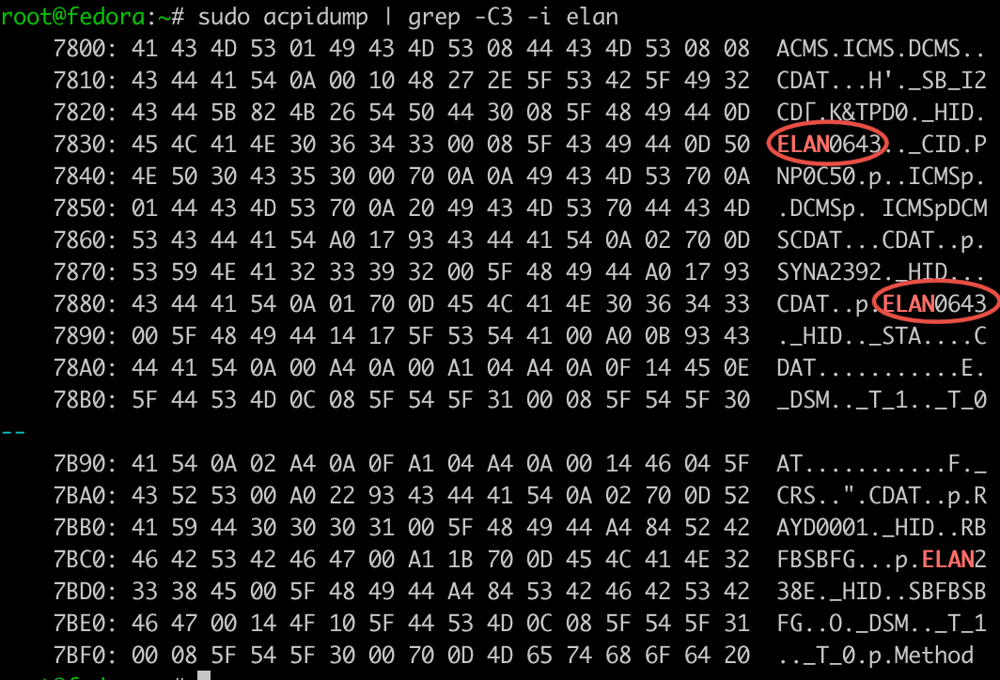

# Elan touchpad driver

## History

Fork of [this fork](https://github.com/pavlepiramida/elan_i2c_dkms) of [this project](https://github.com/Jookia/elan_i2c_dkms) which seems not maintened anymore.

This has been tested on Ubuntu 24.04.1 LTS with the following kernel:

```shell
$ uname -r
6.8.0-41-generic
```

## Getting started

To install, check and replace the values in the [dkms.conf](./dkms.conf) file (follow the comments you'll find there).

Then, run this in a terminal:

```shell
sudo apt install -y git dkms
git clone https://github.com/idrissneumann/elan_i2c_dkms.git
cd elan_i2c_dkms
sudo dkms install .
```

Then reboot your machine.

## How to update this driver

If it still not working, here's how I updated this driver on Fedora 40:

```shell
sudo apt install -y acpidump
sudo acpidump | grep -C3 -i elan
```

Pick the value you'll find here:



And add it [here](./elan_i2c_core.c#1269)

## Uninstall

```shell
sudo dkms remove elan_i2c/10.0 --all
```
